# 🏗️ BugBoard Architecture

This document describes the architecture, application layers, request flow, security model, data model and major integrations used in **BugBoard – Bug & Issue Tracking System**.

---

## 1. Architecture Overview

BugBoard follows a **client-server architecture** with a React single-page application communicating with a Node.js/Express REST API. MongoDB is used as the primary persistent data store.

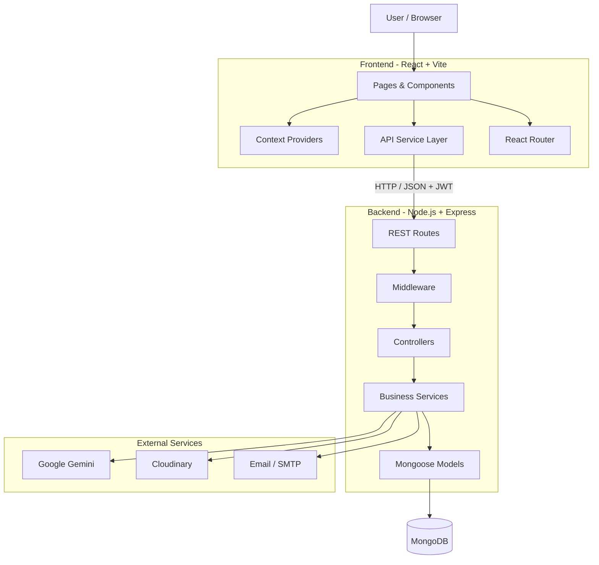

---

## 2. High-Level Components

| Component | Technology | Responsibility |
|---|---|---|
| Client | React + Vite | User interface and client-side routing |
| Styling | Tailwind CSS | Responsive UI styling |
| API Client | Axios | HTTP communication with backend |
| State | React Context / Hooks | Authentication, notifications and UI state |
| Server | Node.js + Express | REST API and application logic |
| Authentication | JWT + bcryptjs | Authentication and password security |
| Validation | Joi | Request validation |
| Database | MongoDB + Mongoose | Persistent data storage |
| AI | Google Gemini | AI-assisted bug analysis and discussion summaries |
| File Storage | Cloudinary | Uploaded file/media storage |
| Email | Nodemailer | Email notification support |

---

# 3. Frontend Architecture

The frontend is a React application built with Vite.

```text
client/
│
├── src/
│   ├── components/
│   ├── config/
│   ├── context/
│   ├── hooks/
│   ├── layouts/
│   ├── pages/
│   ├── routes/
│   ├── services/
│   ├── App.jsx
│   └── main.jsx
│
├── package.json
├── vite.config.js
└── tailwind.config.js
```

## 3.1 Pages

Pages represent major application screens.

```text
pages/
├── auth/
│   ├── LoginPage
│   ├── RegisterPage
│   ├── ForgotPasswordPage
│   └── ResetPasswordPage
│
├── dashboard/
│   └── DashboardPage
│
├── issues/
│   ├── CreateIssuePage
│   ├── EditIssuePage
│   ├── IssueDetailPage
│   ├── IssueListPage
│   └── KanbanBoardPage
│
├── projects/
│   ├── ProjectListPage
│   └── ProjectDetailPage
│
├── analytics/
│   └── AnalyticsPage
│
├── admin/
│   ├── UserManagementPage
│   └── AuditLogPage
│
└── profile/
    └── ProfilePage
```

---

## 3.2 Reusable Components

Reusable UI and feature components are separated from pages.

Examples:

```text
components/
├── common/
├── dashboard/
├── issues/
├── kanban/
├── comments/
├── activity/
├── charts/
├── ai/
└── layout/
```

This allows common functionality such as buttons, tables, modals, issue cards, comments and charts to be reused across multiple screens.

---

## 3.3 Context and Hooks

React Context is used for application-wide client state.

```text
context/
├── AuthContext.jsx
├── NotificationContext.jsx
└── ToastContext.jsx
```

Custom hooks encapsulate reusable client-side behavior:

```text
hooks/
├── useAuth.js
├── useFetch.js
├── useNotification.js
├── useToast.js
└── useDebounce.js
```

---

# 4. Frontend Routing & Access Control

The application uses React Router.

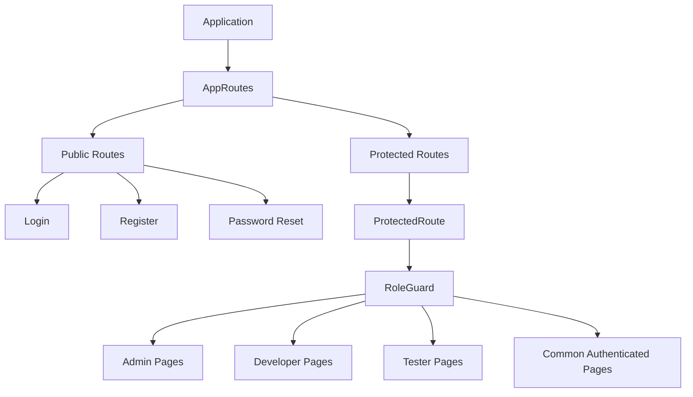

### Route protection

Two important route guards are used:

- `ProtectedRoute` – prevents unauthenticated access.
- `RoleGuard` – restricts pages/features according to the user's role.

---

# 5. API Communication

The frontend uses a centralized Axios instance:

```text
client/src/services/api.js
```

The default development API base URL is:

```text
http://localhost:5000/api/v1
```

The URL can be changed using:

```env
VITE_API_URL=...
```

## Request flow

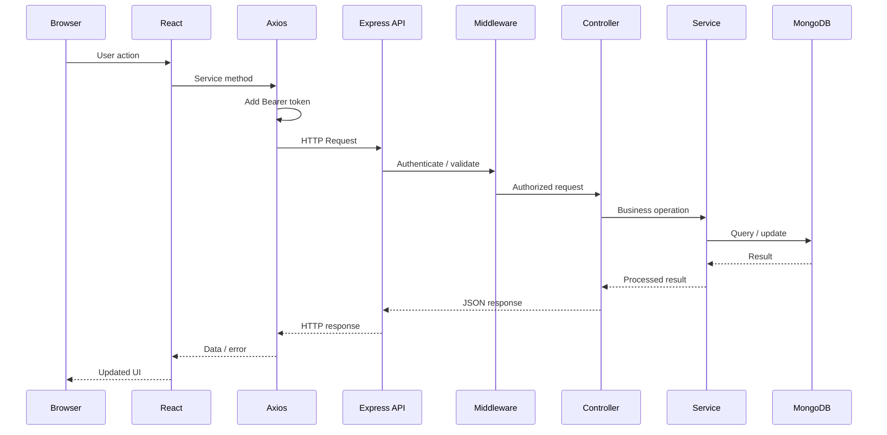

---

# 6. Backend Architecture

The backend is a modular Express application.

```text
server/
│
├── config/
├── controllers/
├── middleware/
├── models/
├── routes/
├── services/
├── utils/
├── validators/
├── seeds/
├── app.js
└── server.js
```

The backend generally follows:

```text
Route
  ↓
Middleware
  ↓
Controller
  ↓
Service
  ↓
Model
  ↓
MongoDB
```

---

# 7. Route Layer

Routes define the HTTP endpoints exposed by the application.

Main route modules include:

```text
auth.routes.js
user.routes.js
project.routes.js
issue.routes.js
comment.routes.js
activity.routes.js
notification.routes.js
analytics.routes.js
telemetry.routes.js
ai.routes.js
upload.routes.js
```

The main API prefix is:

```text
/api/v1
```

Important API areas include:

```text
/api/v1/auth
/api/v1/users
/api/v1/projects
/api/v1/issues
/api/v1/comments
/api/v1/activities
/api/v1/notifications
/api/v1/analytics
/api/v1/telemetry
/api/v1/ai
/api/v1/upload
```

A health endpoint is also available:

```text
GET /health
```

---

# 8. Middleware Layer

Middleware handles cross-cutting concerns before requests reach business logic.

```text
middleware/
├── auth.middleware.js
├── role.middleware.js
├── projectMember.middleware.js
├── validate.middleware.js
├── upload.middleware.js
├── rateLimiter.middleware.js
└── error.middleware.js
```

### Responsibilities

### Authentication Middleware

Reads the JWT bearer token and verifies the authenticated user.

```text
Authorization: Bearer <token>
```

### Role Middleware

Checks whether the authenticated user has the required role.

Example roles:

```text
ADMIN
DEVELOPER
TESTER
```

### Project Member Middleware

Controls project-specific access.

### Validation Middleware

Validates incoming request data before business logic is executed.

### Upload Middleware

Handles incoming file uploads.

### Rate Limiter

Helps protect API endpoints against excessive requests.

### Error Middleware

Provides centralized handling for application errors.

---

# 9. Controller Layer

Controllers handle HTTP-level operations.

```text
controllers/
├── auth.controller.js
├── user.controller.js
├── project.controller.js
├── issue.controller.js
├── comment.controller.js
├── activity.controller.js
├── notification.controller.js
├── analytics.controller.js
├── ai.controller.js
└── upload.controller.js
```

Controllers are responsible for:

1. Reading request parameters/body.
2. Calling the appropriate service/business logic.
3. Returning the HTTP response.
4. Handling controller-level errors.

---

# 10. Service Layer

Business logic is separated into dedicated services.

```text
services/
├── auth.service.js
├── issueWorkflow.service.js
├── notification.service.js
├── email.service.js
├── ai.service.js
├── duplicateDetection.service.js
├── storage.service.js
├── token.service.js
└── audit.service.js
```

Examples:

### `issueWorkflow.service.js`

Handles issue status/workflow transitions.

### `notification.service.js`

Creates and manages application notifications.

### `duplicateDetection.service.js`

Supports duplicate issue detection/analysis.

### `ai.service.js`

Communicates with Google Gemini and provides fallback behavior when the AI service is unavailable.

### `storage.service.js`

Handles storage-related operations.

### `email.service.js`

Handles email-related functionality.

---

# 11. Database Architecture

MongoDB is used as the primary database.

Mongoose provides schema definitions and database access.

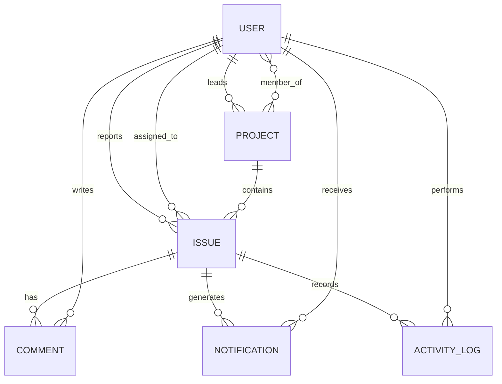

## Main Models

```text
User
Project
Issue
Comment
Notification
ActivityLog
Token
```

---

# 12. Issue Domain Architecture

The Issue entity is the central domain object of BugBoard.

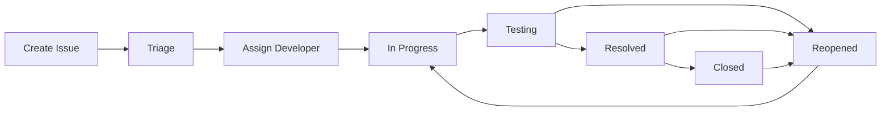

An issue contains information such as:

- Issue key
- Title
- Description
- Status
- Severity
- Priority
- Project
- Reporter
- Assignee
- Labels
- Steps to reproduce
- Expected result
- Actual result
- Environment information
- Attachments
- Timestamps

---

# 13. Authentication Architecture

BugBoard uses JWT-based authentication.

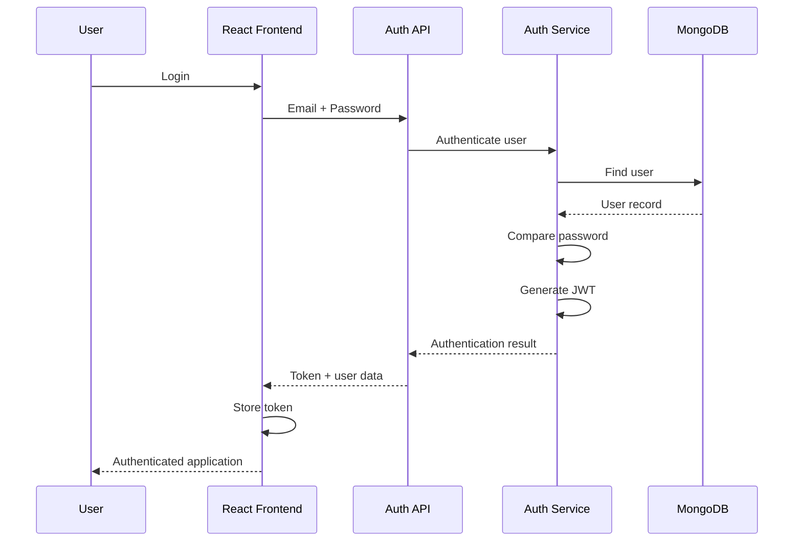

For authenticated API calls:

```text
React
  ↓
Axios interceptor
  ↓
Authorization: Bearer <JWT>
  ↓
Express authentication middleware
  ↓
Protected controller/service
```

If an API response returns `401 Unauthorized`, the frontend removes the stored authentication data and redirects the user to the login page.

---

# 14. Role-Based Access

BugBoard uses role-based authorization.

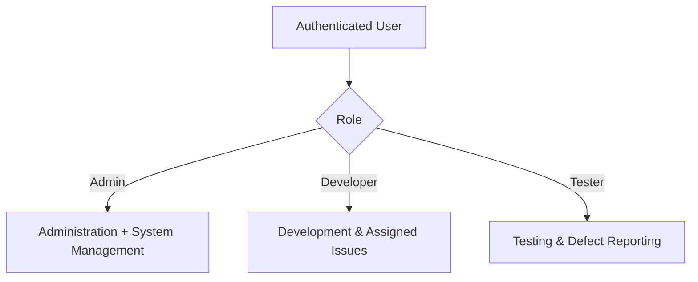

Role checks are performed on protected backend routes, while frontend route guards provide the corresponding client-side navigation restrictions.

---

# 15. AI Architecture

BugBoard integrates Google Gemini for AI-assisted defect analysis.

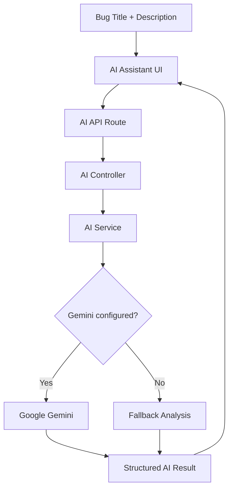

The AI response can include:

```json
{
  "summary": "...",
  "severity": "Medium",
  "priority": "High",
  "labels": ["bug"],
  "rootCauses": [],
  "debuggingSteps": [],
  "testCases": []
}
```

The server also supports AI-assisted discussion summarization.

---

# 16. Duplicate Detection

The project contains a dedicated duplicate detection service.

A typical flow is:

```text
New Issue
   ↓
Issue Title + Description
   ↓
Duplicate Detection Service
   ↓
Compare with existing issue information
   ↓
Potential duplicate results
   ↓
Duplicate Warning UI
```

The frontend contains:

```text
DuplicateWarningModal
DuplicateAnalysisView
```

to surface duplicate-related information to users.

---

# 17. Notification Architecture

Notifications can be generated by application events such as issue assignments and other issue/project activity.

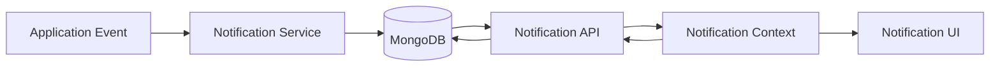

Email-related functionality is handled separately through the email service.

---

# 18. File Upload Architecture

The backend contains upload middleware and storage services.

```text
User
 ↓
React File Attachment UI
 ↓
Upload API
 ↓
Upload Middleware
 ↓
Storage Service
 ↓
Cloudinary / Configured Storage
 ↓
Stored File Reference
 ↓
Issue
```

This keeps file handling separate from the core issue business logic.

---

# 19. Analytics Architecture

Analytics are generated from issue/project data and exposed through the analytics/telemetry API.

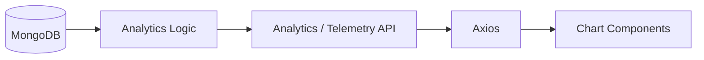

Frontend chart components include:

```text
StatusPieChart
TrendLineChart
WorkloadBarChart
```

These support visualization of issue status, trends and workload-related information.

---

# 20. Security Architecture

Security is implemented at multiple layers.

```text
Browser
   │
   ▼
CORS
   │
   ▼
Express
   │
   ├── Helmet
   ├── Rate Limiting
   ├── Authentication
   ├── Role Authorization
   ├── Project Membership
   ├── Request Validation
   └── Error Handling
   │
   ▼
Controllers / Services
   │
   ▼
MongoDB
```

Security-related technologies include:

- JWT authentication
- bcryptjs password hashing
- Helmet
- CORS
- Rate limiting
- Joi validation
- Protected routes
- Role-based authorization
- Project membership checks
- Centralized error handling

---

# 21. Error Handling

The backend has centralized error handling.

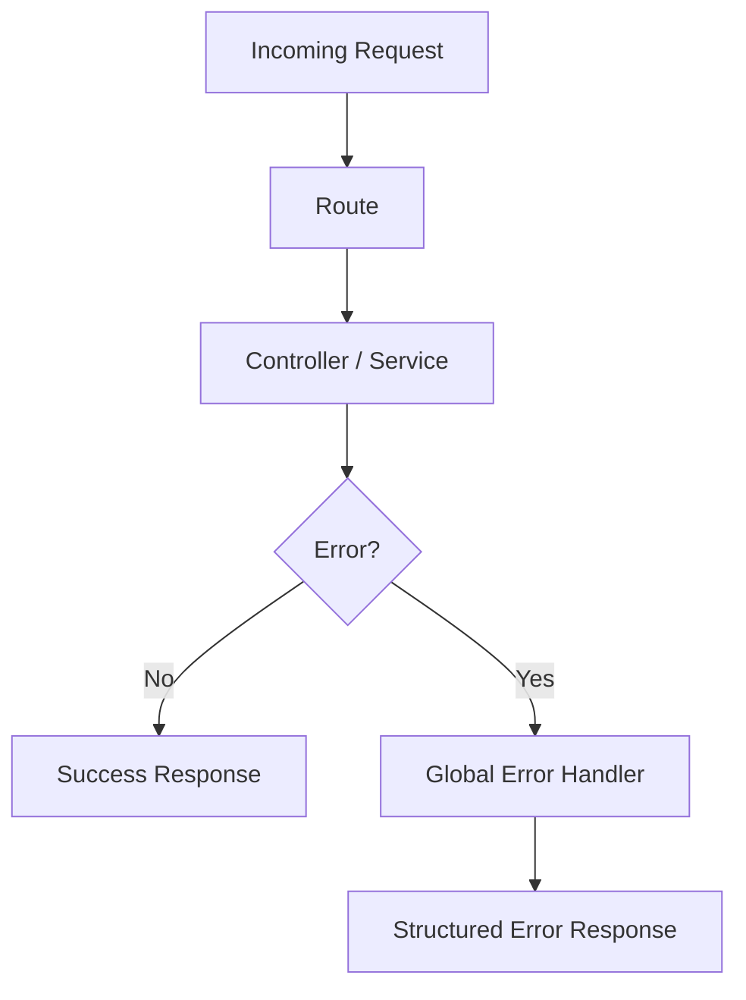

The frontend also handles authentication errors. For example, a `401 Unauthorized` response causes the client to clear authentication information and return the user to the login page.

---

# 22. Deployment Architecture

The project contains Docker Compose configuration and frontend deployment configuration.

A production deployment can follow this model:

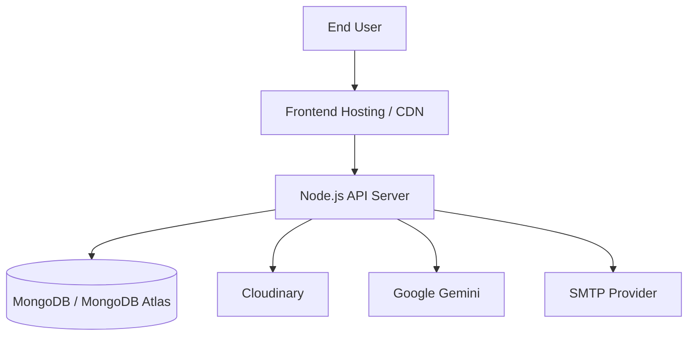

Environment-specific configuration should be provided through environment variables rather than hard-coded credentials.

---

# 23. Configuration & Environment

The project uses environment variables for configuration.

Examples include:

```env
MONGO_URI=
JWT_ACCESS_SECRET=
JWT_REFRESH_SECRET=
GEMINI_API_KEY=
CLOUDINARY_CLOUD_NAME=
CLOUDINARY_API_KEY=
CLOUDINARY_API_SECRET=
SMTP_HOST=
SMTP_PORT=
SMTP_USER=
SMTP_PASS=
```

Frontend configuration can include:

```env
VITE_API_URL=
```

### Security rule

Never commit real secrets to GitHub.

Use:

```text
.env.example
```

with placeholder values for documentation.

---

# 24. Complete Request Lifecycle

The following summarizes a typical issue creation request:

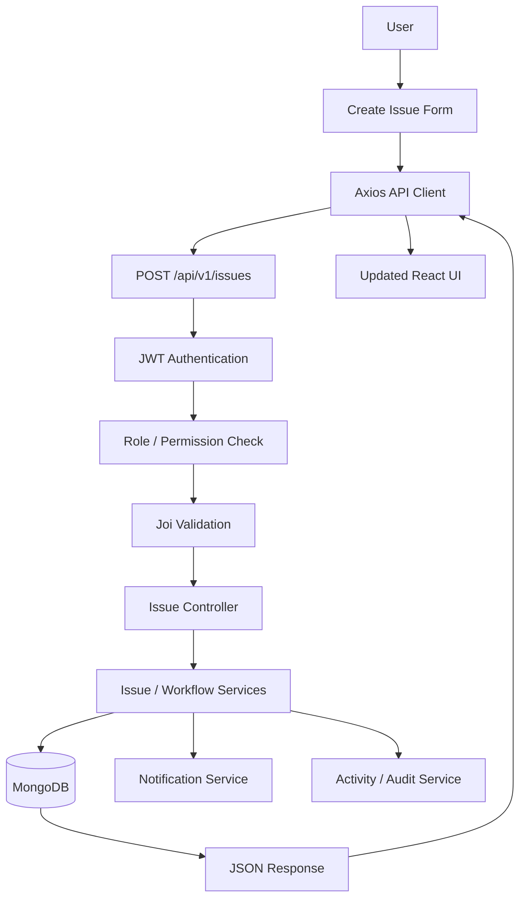

---

# 25. Design Principles

The architecture follows these main principles:

### Separation of Concerns

Frontend presentation, API communication, backend business logic and persistence are separated.

### Reusability

Reusable React components, hooks, services and backend utilities reduce duplication.

### Security by Layers

Authentication, authorization, validation, rate limiting and security middleware provide multiple protection layers.

### Modular Backend

Routes, controllers, services, models and middleware are organized into separate responsibilities.

### Maintainability

Feature-specific modules make it easier to modify or extend the application.

### Extensibility

The architecture allows future integrations such as additional AI providers, project management integrations, real-time communication and automated testing.

---

# 26. Summary

BugBoard uses a modular full-stack architecture:

```text
┌──────────────────────────────────────────┐
│              React Frontend              │
│  Pages • Components • Context • Hooks    │
│             Axios • Router               │
└────────────────────┬─────────────────────┘
                     │
                     │ REST / JSON / JWT
                     ▼
┌──────────────────────────────────────────┐
│          Node.js + Express API           │
│ Routes → Middleware → Controllers        │
│              → Services                  │
└────────────────────┬─────────────────────┘
                     │
                     ▼
┌──────────────────────────────────────────┐
│             Mongoose Models              │
└────────────────────┬─────────────────────┘
                     │
                     ▼
              ┌─────────────┐
              │   MongoDB   │
              └─────────────┘

External integrations:
Google Gemini • Cloudinary • SMTP/Email
```

This architecture supports the complete bug-management lifecycle while keeping the frontend, backend, database and external integrations modular and independently maintainable.
