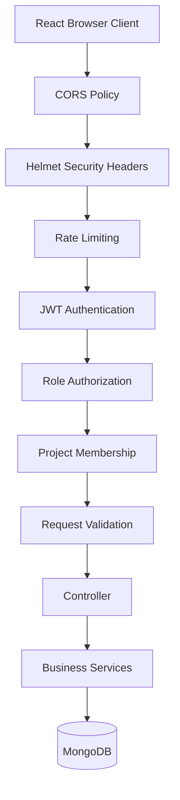
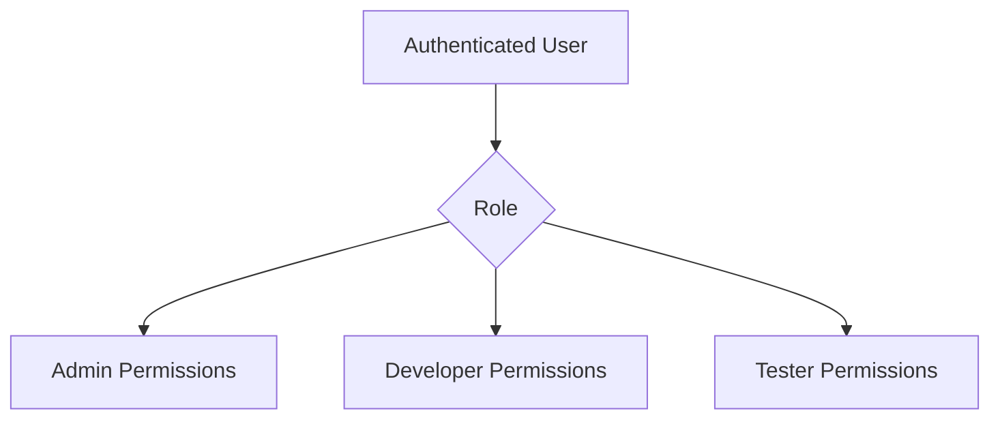

# 🔐 BugBoard Security Documentation

This document describes the security architecture and defensive controls implemented in **BugBoard – Bug & Issue Tracking System**.

BugBoard is a full-stack application built with React, Node.js, Express and MongoDB. Security is applied at multiple layers, including authentication, authorization, password protection, input validation, HTTP hardening, rate limiting, CORS and secure environment configuration.

---

## 1. Security Architecture



The objective is to prevent unauthorized access, malformed requests, accidental exposure of secrets and common web/API abuse.

---

# 2. Authentication

BugBoard uses **JSON Web Tokens (JWT)** for authenticated API access.

The authentication flow is:

```text
User
  ↓
Login
  ↓
Credentials Validation
  ↓
Password Verification
  ↓
JWT Generation
  ↓
Access Token
  ↓
Protected API Request
  ↓
JWT Verification
  ↓
Authenticated User
```

Protected requests use:

```http
Authorization: Bearer <ACCESS_TOKEN>
```

---

## 2.1 Authentication Middleware

The backend authentication middleware:

1. Reads the `Authorization` header.
2. Extracts the Bearer token.
3. Verifies the JWT.
4. Identifies the authenticated user.
5. Attaches authenticated user information to the request.
6. Rejects invalid or missing credentials.

Example:

```http
GET /api/v1/issues
Authorization: Bearer eyJhbGciOi...
```

An invalid token results in an authentication error instead of allowing the request to continue.

---

# 3. Password Security

Passwords are not stored as plain text.

BugBoard uses:

```text
bcryptjs
```

for password hashing.

The authentication flow is:

```text
Plain Password
      ↓
bcrypt Hash
      ↓
MongoDB
```

During login:

```text
Entered Password
      ↓
bcrypt Comparison
      ↓
Stored Password Hash
      ↓
Match / Reject
```

This prevents the database from storing the original password.

---

# 4. JWT Security

JWT secrets are configured through environment variables.

Example:

```env
JWT_ACCESS_SECRET=your_access_secret
JWT_REFRESH_SECRET=your_refresh_secret
```

Secrets must not be hard-coded in source code.

The project supports separate access/refresh token configuration.

Example expiration configuration:

```env
JWT_ACCESS_EXPIRES_IN=15m
JWT_REFRESH_EXPIRES_IN=7d
```

Production applications should use strong, randomly generated secrets.

---

# 5. Role-Based Authorization

Authentication answers:

> "Who is the user?"

Authorization answers:

> "What is the user allowed to do?"

BugBoard implements role-based access control.

Supported application roles include:

```text
Admin
Developer
Tester
```

Architecture:



Backend role checks are important because frontend restrictions alone can be bypassed by manually sending API requests.

Therefore, privileged operations should always be protected at the API level.

---

# 6. Project-Level Authorization

BugBoard also supports project-related access control.

A user may need to be a member of a project before performing project-specific operations.

The backend includes project membership middleware:

```text
projectMember.middleware.js
```

Typical authorization flow:

```text
JWT Authentication
       ↓
User Identified
       ↓
Role Check
       ↓
Project Membership Check
       ↓
Request Validation
       ↓
Business Logic
```

This provides an additional authorization layer beyond global user roles.

---

# 7. Request Validation

The backend uses **Joi** for request validation.

Validation is important because client-side validation alone cannot be trusted.

Example:

```text
Frontend Validation
       ↓
Backend Validation
       ↓
Business Logic
```

The server validates incoming data before processing it.

Examples of fields that require validation include:

- Email
- Password
- Project name
- Project key
- Issue title
- Issue description
- Severity
- Priority
- Issue status
- MongoDB ObjectIds

---

## 7.1 Why Server-Side Validation Matters

A malicious or modified client can send requests without using the normal React interface.

For example, a user could manually send:

```http
POST /api/v1/issues
```

with arbitrary JSON.

Therefore:

```text
Never trust client-side validation alone.
```

The backend validates requests independently.

---

# 8. HTTP Security Headers

BugBoard includes:

```text
Helmet
```

Helmet helps configure commonly recommended HTTP security headers.

This provides additional browser-side protections against several common web security risks.

Typical protections can include headers related to:

- Content type sniffing
- Referrer policy
- Frame protection
- Browser security behavior
- Content security policy configuration

The exact headers depend on the application's Helmet configuration.

---

# 9. CORS

Cross-Origin Resource Sharing (CORS) controls which browser origins can communicate with the API.

During development, the frontend and backend may run on different ports:

```text
Frontend
http://localhost:5173

Backend
http://localhost:5000
```

The backend therefore needs an appropriate CORS configuration.

Example configuration concept:

```text
Allowed Frontend Origin
        ↓
http://localhost:5173
        ↓
Express CORS Middleware
        ↓
API Access
```

For production, the allowed origin should be restricted to the actual deployed frontend domain rather than allowing arbitrary origins.

---

# 10. Rate Limiting

The backend includes rate-limiting middleware.

Rate limiting helps reduce:

- Brute-force login attempts
- Excessive API requests
- Automated abuse
- Accidental request floods

Conceptually:

```text
Client
  ↓
Request Counter
  ↓
Within Limit?
  ├── Yes → Continue
  └── No  → Reject / Throttle
```

Authentication endpoints are especially important candidates for stricter rate limits.

---

# 11. Input Sanitization

The application includes utility functionality for handling and sanitizing input.

User-controlled content can appear in:

- Issue titles
- Issue descriptions
- Comments
- Labels
- Project descriptions
- User profile information

Input should be validated and safely handled before being persisted or rendered.

---

# 12. MongoDB Security

BugBoard uses MongoDB through Mongoose.

Database credentials are configured through environment variables.

Example:

```env
MONGO_URI=mongodb://localhost:27017/bugboard
```

For MongoDB Atlas:

```env
MONGO_URI=mongodb+srv://<username>:<password>@<cluster>/<database>
```

### Security rules

- Never commit database credentials.
- Use environment variables.
- Use separate development and production databases.
- Restrict production database network access.
- Use strong database credentials.
- Grant only the required database permissions.
- Rotate credentials if they are accidentally exposed.

---

# 13. Environment Variable Security

Sensitive values should be stored in `.env` files locally and configured securely in deployment environments.

Examples:

```env
MONGO_URI=
JWT_ACCESS_SECRET=
JWT_REFRESH_SECRET=
GEMINI_API_KEY=
CLOUDINARY_API_KEY=
CLOUDINARY_API_SECRET=
SMTP_USER=
SMTP_PASS=
```

The following files should not be committed:

```text
.env
server/.env
client/.env
```

Instead, the repository should contain example files:

```text
.env.example
server/.env.example
client/.env.example
```

with placeholder values.

---

# 14. API Key Security

BugBoard can integrate with external services such as Google Gemini and Cloudinary.

Keys must be kept server-side whenever possible.

Example:

```env
GEMINI_API_KEY=...
```

The React frontend should never expose a private Gemini or Cloudinary secret directly in source code.

Recommended architecture:

```text
React
  ↓
BugBoard Backend
  ↓
External Service
```

rather than:

```text
React
  ↓
Private API Key
  ↓
External Service
```

---

# 15. AI Service Security

The AI functionality accepts user-provided issue information.

Example:

```text
Issue Title
Issue Description
```

This data is sent to the backend AI service.

Security considerations include:

- Authenticate AI endpoints.
- Validate incoming issue data.
- Keep AI API keys server-side.
- Avoid sending unnecessary sensitive information to external AI services.
- Do not expose API keys in frontend JavaScript.
- Handle external API failures gracefully.
- Use fallback behavior when the AI provider is unavailable.

Architecture:

```text
Authenticated User
       ↓
AI API Endpoint
       ↓
Validation
       ↓
AI Service
       ↓
Google Gemini
       ↓
Structured Result
       ↓
Frontend
```

---

# 16. File Upload Security

BugBoard supports file uploads.

File uploads are a security-sensitive feature because users can submit arbitrary files.

The backend uses upload middleware and a storage service.

Security practices should include:

- Validate file type.
- Restrict file size.
- Generate safe file names.
- Avoid executing uploaded files.
- Store uploads outside executable application code.
- Use controlled external storage where appropriate.
- Do not trust the original filename.
- Authenticate upload requests.

Architecture:

```text
User File
   ↓
Authenticated Upload Request
   ↓
Upload Middleware
   ↓
File Validation
   ↓
Storage Service
   ↓
Cloudinary / Configured Storage
```

---

# 17. Email Security

BugBoard contains email notification functionality using Nodemailer.

SMTP credentials must be stored in environment variables.

Example:

```env
SMTP_HOST=
SMTP_PORT=
SMTP_USER=
SMTP_PASS=
EMAIL_FROM=
```

Do not place SMTP passwords directly in source code.

---

# 18. Error Handling

The backend uses centralized error handling.

Security-sensitive implementations should avoid exposing:

- Database credentials
- JWT secrets
- API keys
- Stack traces in production
- Internal file paths
- Sensitive user information

A user-facing error should provide useful information without revealing internal implementation details.

Example:

```json
{
  "success": false,
  "message": "Unable to process the request"
}
```

rather than returning sensitive internal error information.

---

# 19. Authentication Error Handling

The frontend handles authentication failures.

Typical flow:

```text
API Request
    ↓
401 Unauthorized
    ↓
Authentication State Cleared
    ↓
User Redirected to Login
```

A `403 Forbidden` response has a different meaning:

```text
401 → Authentication is missing/invalid
403 → User is authenticated but not permitted
```

This distinction is useful when debugging authorization problems.

---

# 20. CSRF Considerations

The current JWT-based API architecture uses Authorization headers for authenticated API requests.

If authentication is later moved to cookie-based sessions, CSRF protection should be added.

Possible protections include:

- SameSite cookie settings
- CSRF tokens
- Origin validation
- Secure cookies

For production deployments, the authentication strategy should be reviewed together with the chosen token storage mechanism.

---

# 21. XSS Considerations

The application displays user-generated content such as:

- Issue descriptions
- Comments
- Project descriptions
- Labels

React escapes normal text output by default.

However, raw HTML rendering should be avoided unless content is explicitly sanitized.

Avoid using:

```jsx
dangerouslySetInnerHTML
```

with untrusted user input.

If rich HTML is required, sanitize it using a trusted HTML sanitization library before rendering.

---

# 22. NoSQL Injection Considerations

Because BugBoard uses MongoDB, request input should not be passed directly into unrestricted database queries.

Recommended approach:

```text
User Input
   ↓
Validation
   ↓
Type / Schema Checks
   ↓
Controlled Query
   ↓
MongoDB
```

Mongoose schemas and validation help enforce expected data structures.

---

# 23. Authorization vs UI Restrictions

Frontend restrictions are not a security boundary.

For example:

```text
React hides Admin button
```

does not prevent a user from manually calling:

```http
PATCH /api/v1/users/:id/role
```

Therefore:

```text
Frontend Guard
      +
Backend Authorization
```

must be used.

The backend remains the authoritative security layer.

---

# 24. Secure Development Practices

Recommended practices for maintaining BugBoard securely:

### Never commit secrets

Do not commit:

```text
.env
API keys
JWT secrets
Database passwords
SMTP passwords
Cloudinary secrets
```

### Use environment variables

Store deployment-specific secrets outside source code.

### Validate every external input

Do not assume frontend validation is sufficient.

### Keep dependencies updated

Regularly review:

```bash
npm audit
```

and update vulnerable packages carefully.

### Use HTTPS in production

Production frontend/API communication should use HTTPS.

### Restrict CORS

Allow only trusted frontend origins.

### Use strong secrets

JWT and database secrets should be long, random and unique.

### Rotate exposed credentials

If a secret is accidentally pushed to GitHub, revoke/rotate it immediately.

---

# 25. Production Security Checklist

Before deploying BugBoard to production:

- [ ] Use HTTPS.
- [ ] Set `NODE_ENV=production`.
- [ ] Use strong JWT access and refresh secrets.
- [ ] Use a secure MongoDB deployment.
- [ ] Restrict MongoDB network access.
- [ ] Do not commit `.env`.
- [ ] Configure production CORS origins.
- [ ] Enable rate limiting.
- [ ] Keep Helmet enabled.
- [ ] Validate all incoming requests.
- [ ] Review file-upload restrictions.
- [ ] Keep AI/API keys server-side.
- [ ] Configure secure SMTP credentials.
- [ ] Avoid exposing stack traces.
- [ ] Review frontend token storage.
- [ ] Run dependency/security audits.
- [ ] Review role permissions.
- [ ] Test `401` and `403` behavior.
- [ ] Review logs for accidental sensitive-data exposure.

---

# 26. Security Testing Checklist

## Authentication

- [ ] Invalid password rejected.
- [ ] Invalid JWT rejected.
- [ ] Missing JWT rejected for protected routes.
- [ ] Expired token handled correctly.
- [ ] Password reset token validated.

## Authorization

- [ ] Developer cannot perform Admin-only operations.
- [ ] Tester cannot perform unauthorized project operations.
- [ ] Non-members cannot access restricted project resources.
- [ ] Backend authorization cannot be bypassed by direct API calls.

## Input Validation

- [ ] Invalid email rejected.
- [ ] Invalid ObjectId rejected.
- [ ] Empty issue title rejected.
- [ ] Invalid severity rejected.
- [ ] Invalid priority rejected.
- [ ] Invalid status rejected.
- [ ] Oversized input rejected.

## File Uploads

- [ ] Unsupported file types rejected.
- [ ] Oversized files rejected.
- [ ] Untrusted filenames handled safely.
- [ ] Unauthorized upload requests rejected.

## API Abuse

- [ ] Rate limits are enforced.
- [ ] Repeated login failures are controlled.
- [ ] Large/malformed requests are handled safely.

---

# 27. Security Incident Response

If a secret is accidentally committed to GitHub:

### 1. Revoke the secret

Immediately invalidate the exposed:

```text
API key
JWT secret
Database password
SMTP password
Cloudinary secret
```

### 2. Generate a replacement

Create a new secret/key.

### 3. Update deployment configuration

Update the new value in the environment.

### 4. Remove the exposed secret from the repository

Removing it from the latest commit alone may not remove it from Git history.

### 5. Review access logs

Check for suspicious usage where possible.

### 6. Rotate related credentials

If one credential was exposed, evaluate whether related credentials should also be rotated.

---

# 28. Security Architecture Summary

BugBoard follows a layered security model:

```text
┌──────────────────────────────────────────┐
│             React Frontend               │
│ Route Guards • Auth State • Validation   │
└────────────────────┬─────────────────────┘
                     │
                     ▼
┌──────────────────────────────────────────┐
│              Express API                 │
│ CORS • Helmet • Rate Limit               │
│ JWT • Roles • Project Membership         │
│ Joi Validation • Error Handling          │
└────────────────────┬─────────────────────┘
                     │
                     ▼
┌──────────────────────────────────────────┐
│          Business / Service Layer        │
│ Issue Workflow • AI • Notifications      │
│ Storage • Audit / Activity               │
└────────────────────┬─────────────────────┘
                     │
                     ▼
┌──────────────────────────────────────────┐
│                MongoDB                   │
│ Users • Projects • Issues • Comments     │
│ Notifications • Activities • Tokens      │
└──────────────────────────────────────────┘
```

External services such as Google Gemini, Cloudinary and SMTP are accessed through controlled backend integrations.

---

# 29. Conclusion

Security in BugBoard is implemented as a layered defense rather than relying on a single mechanism.

The key protections are:

- JWT authentication
- bcrypt password hashing
- Role-based authorization
- Project-level access control
- Joi request validation
- Helmet security headers
- CORS controls
- Rate limiting
- Centralized error handling
- Environment-based secret management
- Protected external-service integrations
- Secure file-upload design

The most important production rule is:

> **Never treat the frontend as a security boundary. Authorization and validation must always be enforced by the backend.**

---

## 👩‍💻 Author

**Kaveri Kadu**

MERN Stack Developer | React | Node.js | MongoDB
